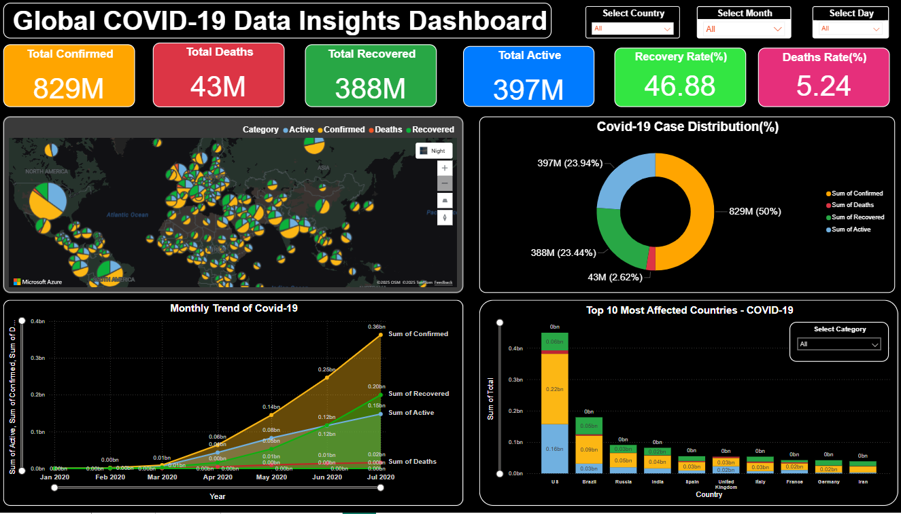
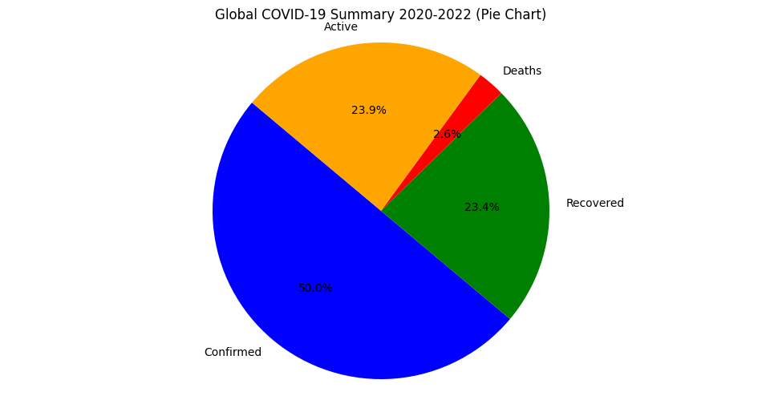
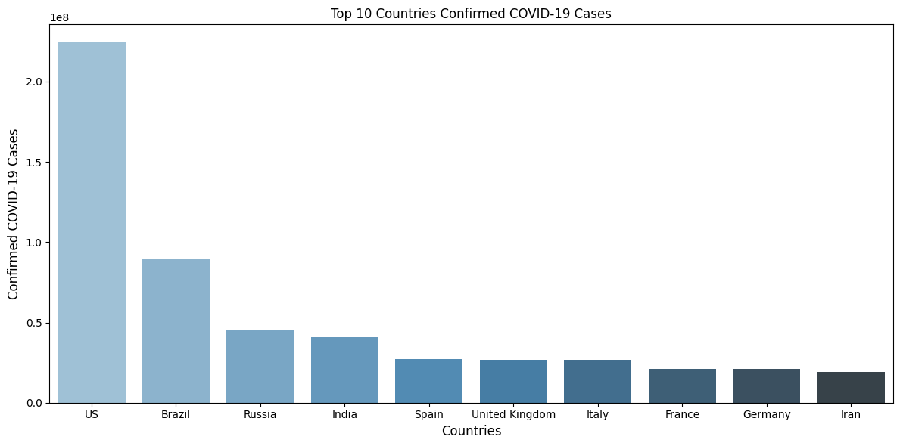
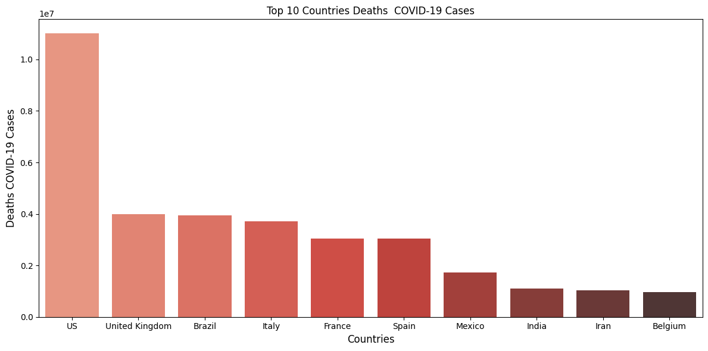

# 🦠 COVID-19 Data Analysis & Power BI Dashboard

An end-to-end **Data Analysis and Business Intelligence project** focused on analyzing COVID-19 cases, recoveries, deaths, and trends using **Python and Power BI**.

The project combines **Exploratory Data Analysis (EDA), data visualization, statistical analysis, and interactive dashboard development** to extract meaningful insights from COVID-19 data.

---

## 📌 Project Overview

The COVID-19 pandemic generated large amounts of data related to confirmed cases, recoveries, deaths, and active cases.

This project analyzes that data to answer questions such as:

* How did COVID-19 cases change over time?
* Which countries/regions were most affected?
* What were the recovery and death trends?
* How did active cases change?
* What patterns can be identified from the data?
* How can the analysis be presented through an interactive dashboard?

---

## 🎯 Objectives

* Perform data cleaning and preprocessing.
* Conduct Exploratory Data Analysis using Python.
* Analyze COVID-19 case trends.
* Compare confirmed, recovered, active, and death cases.
* Calculate recovery and death rates.
* Create meaningful visualizations.
* Build an interactive **Power BI dashboard**.
* Generate insights that can support data-driven understanding of the pandemic.

---

## 🛠️ Technologies Used

### Programming & Data Analysis

* Python
* Pandas
* NumPy
* Matplotlib
* Seaborn
* Scikit-learn

### Business Intelligence

* Microsoft Power BI

### Development Environment

* Jupyter Notebook
* GitHub

---

## 📂 Project Structure

```text
covid19_data_insights/
│
├── data/
│   └── COVID-19 dataset
│
├── notebooks/
│   └── covid_19_data_analysis.ipynb
│
├── dashboard/
│   └── covid19_dashboard.pbix
│
├── screenshots/
│   ├── dashboard_01.png
│   ├── dashboard_02.png
│   ├── dashboard_03.png
│   ├── dashboard_04.png
│   ├── dashboard_05.png
│   ├── dashboard_06.png
│   ├── analysis_01.png
│   ├── analysis_02.png
│   ├── analysis_03.png
│   └── ...
│
├── README.md
├── requirements.txt
└── .gitignore
```

> **Note:** The dataset is not included in this repository if it is sourced from external platforms. Please download the dataset from the original source before running the notebook.

---

## 🔍 Data Analysis Workflow

The project follows a structured data analysis workflow:

```text
Raw COVID-19 Data
        ↓
Data Cleaning
        ↓
Data Preprocessing
        ↓
Exploratory Data Analysis
        ↓
Statistical Analysis
        ↓
Data Visualization
        ↓
Power BI Dashboard
        ↓
Insights & Conclusions
```

---

## 🧹 Data Preprocessing

The dataset was prepared for analysis by performing operations such as:

* Handling missing values
* Removing unnecessary columns
* Checking duplicate records
* Converting data types
* Formatting date-related information
* Preparing data for visualization
* Creating useful analytical features

---

## 📊 Exploratory Data Analysis

Python was used to explore COVID-19 trends and relationships.

The analysis includes:

* Confirmed case analysis
* Death case analysis
* Recovery analysis
* Active case analysis
* Country/region comparison
* Time-series analysis
* Recovery rate analysis
* Death rate analysis
* Correlation analysis

---

## 📈 Power BI Dashboard

An interactive **Power BI dashboard** was created to provide a visual overview of COVID-19 trends.

### Dashboard Features

* Confirmed Cases
* Recovered Cases
* Death Cases
* Active Cases
* Country/Region Analysis
* Trend Analysis
* Recovery Rate
* Death Rate
* Interactive filters and visualizations

### Dashboard Preview





---

## 📸 Analysis Visualizations

Some of the analysis results are available in the `screenshots/` folder.

Example:







---

## 💡 Key Insights

The analysis helps identify:

* COVID-19 cases increased significantly during major pandemic waves.
* The number of confirmed cases varied considerably across countries and regions.
* Recovery and death rates changed over time.
* Active cases provided an important indicator of the ongoing pandemic situation.
* Data visualization makes it easier to understand complex COVID-19 trends.

> Exact insights may vary depending on the dataset version and date range used for analysis.

---

## 🤖 Machine Learning Analysis

The project also explores the possibility of using machine learning techniques to analyze COVID-19 case patterns.

Models can be used to study relationships between different COVID-19 indicators and explore potential prediction approaches.

The notebook contains the detailed implementation and analysis.

---

## 📊 Skills Demonstrated

This project demonstrates practical experience in:

* Data Cleaning
* Data Preprocessing
* Exploratory Data Analysis
* Data Visualization
* Statistical Analysis
* Feature Engineering
* Machine Learning
* Power BI Dashboard Development
* Python Programming
* Data Storytelling
* Git & GitHub

---

## 🚀 How to Run the Project

### 1. Clone the repository

```bash
git clone https://github.com/s56874/covid19_data_insights.git
```

### 2. Open the project

Open the project folder in **VS Code** or **Jupyter Notebook**.

### 3. Install dependencies

```bash
pip install -r requirements.txt
```

### 4. Add the dataset

Download the required COVID-19 dataset and place it inside:

```text
data/
```

### 5. Run the notebook

Open:

```text
notebooks/covid_19_data_analysis.ipynb
```

Run the cells sequentially.

### 6. Open the Power BI Dashboard

Open:

```text
dashboard/covid19_dashboard.pbix
```

using Microsoft Power BI Desktop.

---

## 📚 Data Sources

The project can use publicly available COVID-19 datasets from sources such as:

* Kaggle
* Johns Hopkins CSSE
* Our World in Data

The exact dataset used should be mentioned here with its original source link.

---

## 🔮 Future Improvements

Possible improvements include:

* Real-time COVID-19 data integration
* Automated data updates
* More advanced forecasting models
* Interactive web-based dashboard
* Country-level comparison
* Additional statistical analysis
* Deployment using Streamlit
* Automated Power BI data refresh

---

## 👨‍💻 Author

**Samarth Kokate**

B.Tech Computer Science / Engineering — Data Science

Interested in:

* Data Science
* Artificial Intelligence
* Machine Learning
* Data Analytics
* Python
* SQL
* Power BI

---

## ⭐ Project Highlights

```text
✓ Python Data Analysis
✓ Exploratory Data Analysis
✓ COVID-19 Trend Analysis
✓ Data Visualization
✓ Machine Learning Exploration
✓ Interactive Power BI Dashboard
✓ Data Storytelling
✓ End-to-End Data Analytics Project
```

---

## 📌 GitHub Repository

**COVID-19 Data Analysis & Power BI Dashboard**

Built as a practical project to demonstrate **Data Science, Data Analytics, Python, and Business Intelligence skills**.


